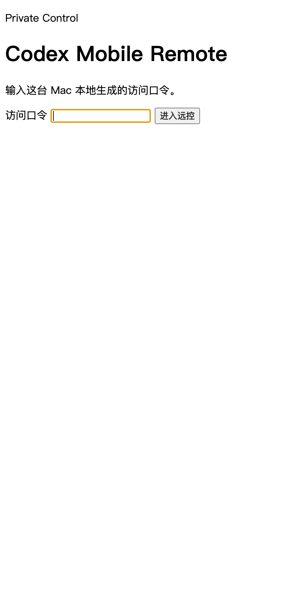
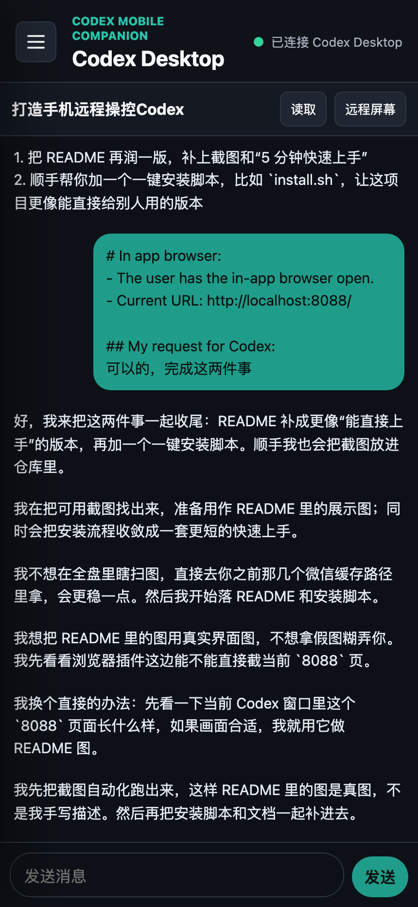

# Codex Mobile Remote

这是一个给 **Codex Desktop** 配的手机网页伴侣。

它的目标很简单：

- 在手机上看电脑里的 Codex 对话
- 在手机上继续发消息
- 实际执行仍然发生在你的 Mac 上
- 真碰到结构化桥接不稳时，再退回远程屏幕兜底

它不是独立的 Codex 客户端，而是一个运行在 **Mac 本机** 的桥接服务。

## 效果图

### 登录页



### 手机聊天页



## 5 分钟快速上手

### 1. 克隆项目

```bash
git clone https://github.com/Alex036225/codex-mobile-remote.git
cd codex-mobile-remote
```

### 2. 一键安装

```bash
bash install.sh
```

这个脚本会帮你做几件事：

- 检查是不是 macOS
- 检查 Node.js 版本是不是 20+
- 安装 npm 依赖
- 修正脚本执行权限
- 自动生成手机访问口令 `.remote-token`

### 3. 启动服务

前台启动：

```bash
npm start
```

后台启动：

```bash
./scripts/start-background.sh
```

### 4. 查看访问口令

```bash
cat .remote-token
```

### 5. 手机打开

先在 Mac 上查局域网 IP：

```bash
ipconfig getifaddr en0
```

如果返回：

```text
192.168.0.116
```

那么手机访问：

```text
http://192.168.0.116:8088
```

注意：**不要在手机上访问 `http://localhost:8088`**，因为 `localhost` 指的是手机自己，不是你的 Mac。

## 适用场景

- 人在外面，想从手机继续电脑上的 Codex 工作
- 不想一直盯着 Mac 屏幕，但想快速给 Codex 发一条消息
- 希望手机端优先显示聊天内容，远程屏幕只作为兜底

## 目前能力

- 手机网页登录
- 查看最近的 Codex 线程
- 打开线程查看 `user / assistant` 文本消息
- 在手机上向指定线程发送消息
- 实时刷新线程内容
- 在需要时回退到 VNC / noVNC 远程屏幕
- 针对 Codex Desktop 做了多层桥接：
  - 优先尝试 Desktop 内部桥
  - 必要时使用本地 app-server
  - 必要时再走桌面 UI/CDP 同步

## 系统要求

建议环境：

- macOS
- 已安装 **Codex Desktop**
- Node.js 20+
- 手机和这台 Mac 在同一局域网，或通过 Tailscale 连通

可选但推荐：

- `tmux`：后台常驻更方便
- `Tailscale`：外网访问更稳

## 项目结构

```text
codex-mobile-remote/
├── public/         手机网页前端
├── server/         本地桥接服务
├── scripts/        启停、OCR、点击、AppleScript 辅助脚本
├── docs/images/    README 截图
├── install.sh      一键安装脚本
├── package.json
└── README.md
```

## 安装

### 方式一：推荐，直接用安装脚本

```bash
bash install.sh
```

### 方式二：手动安装

```bash
npm install
chmod +x scripts/*.sh
```

启动后如果还没有 `.remote-token`，服务会自动生成。

## 启动方式

### 前台启动

```bash
npm start
```

或者：

```bash
./scripts/start.sh
```

默认监听：

```text
http://localhost:8088
```

### 后台启动

```bash
./scripts/start-background.sh
```

它会用一个名为 `codex-mobile-remote` 的 `tmux` session 挂起来。

停止后台服务：

```bash
./scripts/stop.sh
```

查看状态：

```bash
./scripts/status.sh
```

## 手机怎么访问

### 1. 查本机局域网 IP

例如：

```bash
ipconfig getifaddr en0
```

### 2. 手机打开服务地址

```text
http://<你的Mac局域网IP>:8088
```

### 3. 输入网页登录口令

口令保存在项目根目录：

```text
.remote-token
```

## 外网访问

最推荐：

- 使用 **Tailscale**

这样你可以直接用这台 Mac 的 Tailscale IP 或 MagicDNS 域名访问：

```text
http://<tailscale-ip>:8088
```

不建议直接把这些端口裸露到公网：

- `8088`
- `5900`
- `18795`

## 如果要启用远程屏幕

本项目保留了 noVNC 兜底。如果你想在手机上直接看 Mac 屏幕，需要先开启 macOS 屏幕共享。

打开路径：

```text
系统设置 -> 通用 -> 共享 -> 屏幕共享
```

建议同时设置：

- 开启 `Screen Sharing`
- 给当前 macOS 用户控制权限
- 如果你想让 VNC 密码登录更稳定，启用 Legacy VNC / VNC viewer password

## Codex Desktop 相关说明

这个项目最难的部分，不是普通聊天，而是尽量接近 **真实 Codex Desktop 正在使用的线程**。

因此项目做了多层兼容：

### 1. Desktop control socket

优先查找：

```text
~/.codex/app-server-control/app-server-control.sock
```

如果存在，会优先尝试连接真实 Desktop 的控制通道。

### 2. 本地 app-server

如果真实 control socket 不可用，会退回到 bridge 自己接的本地 app-server。

### 3. Desktop CDP / UI 同步

如果底层线程更新了，但桌面 UI 没及时显示，就会通过 Codex Desktop 的调试桥补同步。

这个模式依赖：

```text
--remote-debugging-port=9222
```

如果你需要手动启动调试模式，可以执行：

```bash
open -na /Applications/Codex.app --args --remote-debugging-port=9222
```

## 配置项

目前主要通过环境变量控制：

### 端口

```bash
PORT=8088
```

### VNC 主机与端口

```bash
VNC_HOST=127.0.0.1
VNC_PORT=5900
```

### 是否强制使用 VNC 密码认证

```bash
FORCE_VNC_PASSWORD_AUTH=1
```

### 允许发送失败后回退到旧的桌面自动化

默认不建议启用，只有调试时再开：

```bash
CODEX_DESKTOP_SEND_FALLBACK=1
```

## 常用命令

### 启动服务

```bash
npm start
```

### 后台启动

```bash
./scripts/start-background.sh
```

### 查看状态

```bash
./scripts/status.sh
```

### 停止后台服务

```bash
./scripts/stop.sh
```

### 查看访问口令

```bash
cat .remote-token
```

## 常见问题

### 1. 手机打不开网页

先检查：

- 服务是否已经启动
- 手机和 Mac 是否在同一网络
- 访问的是不是 `http://你的MacIP:8088`
- macOS 防火墙有没有拦截

### 2. 手机能打开，但发消息后电脑端没变化

这通常不是手机问题，而是 Desktop 线程同步层没有完全接上。

可以先确认：

- Codex Desktop 当前是否正常打开
- 目标线程是否存在
- 是否允许桥接服务访问 Desktop

### 3. 为什么手机上看到的和电脑端画面不完全一样

因为这个项目优先保证：

- 线程消息内容正确
- 手机可继续发消息

桌面 UI 的实时完全镜像，是更难的一层，目前通过补同步尽量靠近。

### 4. 为什么要保留 VNC

因为结构化线程桥不一定覆盖所有 Desktop UI 状态。

VNC 的作用是兜底：

- 看屏幕
- 确认当前窗口
- 手动处理特殊情况

## 安全建议

- 不要把 `.remote-token`、`.vnc-password` 提交到 GitHub
- 不要把 8088 / 5900 直接暴露到公网
- 外网访问优先用 Tailscale
- 只在你自己的机器上运行

## 已知限制

当前版本已经能做到：

- 手机发消息
- 线程真实写入
- 尽量同步到 Desktop 正文

但仍然有一些现实限制：

- Codex Desktop 内部接口并不是正式公开 API
- 不同版本的 Desktop 可能会改内部结构
- 某些时候 user 消息和 assistant 回复的桌面显示节奏不完全一致
- 远程屏幕模式依赖 macOS Screen Sharing/VNC 本身

## 开发

开发模式：

```bash
npm run dev
```

检查状态：

```bash
npm run check
```

## 适合谁

这个项目更适合：

- 已经在 Mac 上重度使用 Codex Desktop
- 想从手机“续上电脑里的工作”
- 能接受这是一个偏工程化、偏私有化的桥接工具

如果你想要一个完全正式、稳定、跨版本保证一致的官方手机客户端，这个项目不是那个方向。
